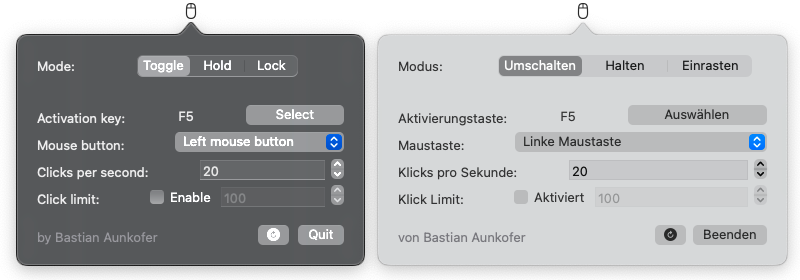

# MaClicker
MaClicker is a simple auto clicker for your Mac. It was built with swift and requires macOS 10.12 Sierra or higher. It is possible to achieve up to 100 clicks per second.
 

 
Two languages are currently supported:
- English
- German

## Usage

### Installation
Download the .dmg file [of the release page](https://github.com/WorldOfBasti/MaClicker/releases), open it and copy the .app file to your applications folder. Open it, it should pop up in your menubar. Don't forget to add MaClicker to the accessibility permissions in the System Preferences:  
System Preferences -> Security & Privacy -> Privacy -> Accessibility

### Select mode
Currently, you can choose between two modes:
- Click  
The click mode enables the auto clicker with the specified clicks per second on the selected mouse button.
- Hold  
The hold mode simply holds the selected mouse button.

### Select activation key
You need to select a hotkey to toggle the auto clicker.

### Select mouse button
Currently, you can choose between two mouse buttons to use:
- Left mouse button
- Right mouse button  

### Select clicks per second (click speed)
You can select how many clicks per second should be pressed.

### Select click limit
You can enable and set a click limit. The auto clicker stops when the limit got reached.

## Building
If you want to build MaClicker from source, follow these steps:
- Check if [cocoapods](https://cocoapods.org) are installed, if not install it with: `sudo gem install cocoapods` in your terminal
- Download the source code
- Open the src folder in your terminal and type: `pod install`
- Open the `MaClicker.xcworkspace` file with xCode
- Build the project

## Acknowledgements
- The [Sauce project](https://github.com/Clipy/Sauce), it helps me [translating a keyCode to the actual key name](https://github.com/WorldOfBasti/MaClicker/blob/master/src/MaClicker/KeyCodeToKeyTransformer.swift).
- The [Sparkle project](https://sparkle-project.org), for the update process

## Want to support this project?
The best way to support this project is to create issues and sending pull requests. Alternatively, you can translate the program to [other languages](https://github.com/WorldOfBasti/MaClicker/blob/master/src/MaClicker/en.lproj/Main.storyboard).